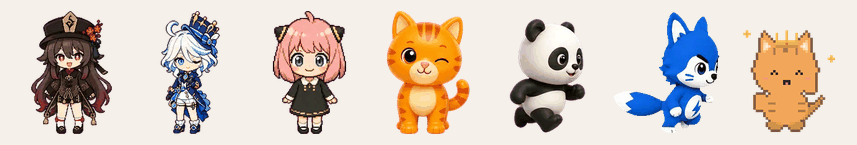
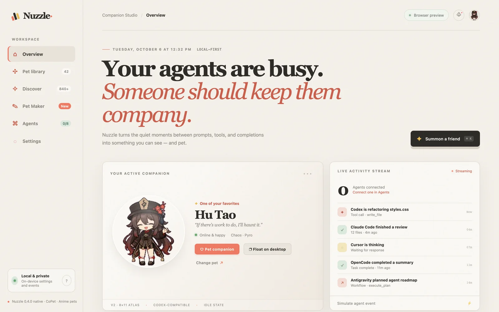
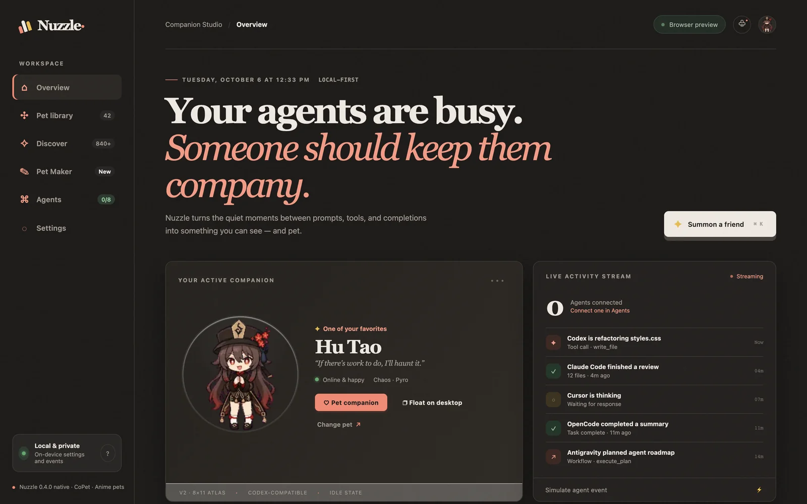
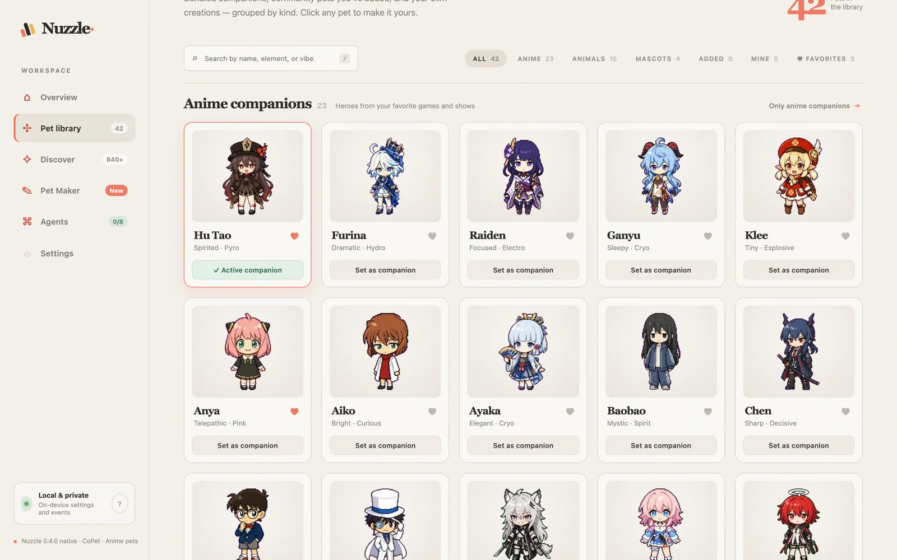
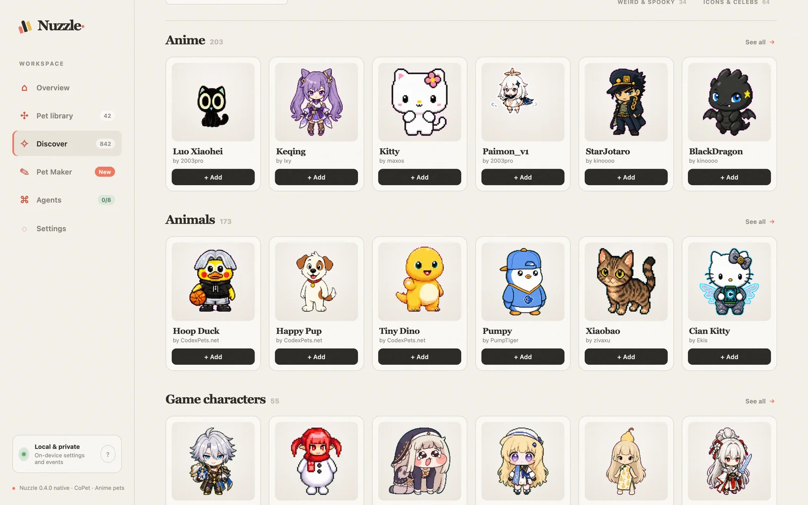
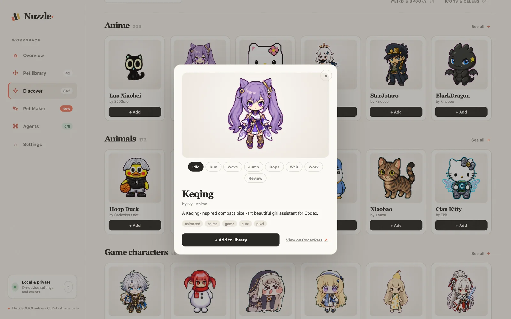
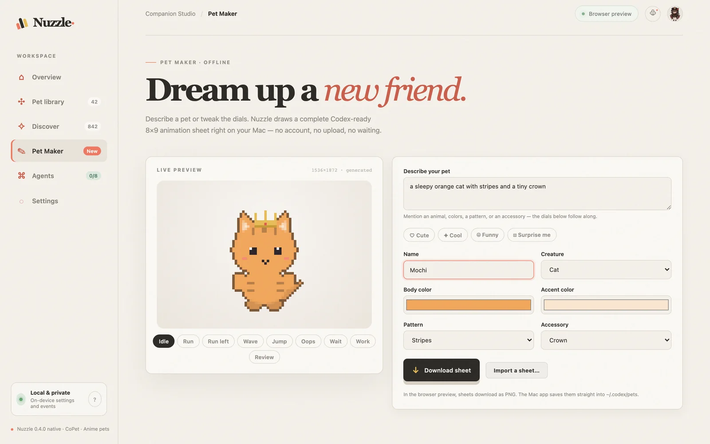

<div align="center">


# Nuzzle — Codex Pets

**A tiny animated companion for your AI coding agents, living right on your Mac.**

It reacts when your agents think, run tools, finish, or fail. Pick from 42 built-in pets, add 840+ community pets, or make your own.

[](https://github.com/satiricalguru/Nuzzle-pets/releases/latest)
&nbsp;
[](assets/nuzzle-tour.mp4)

[](https://github.com/satiricalguru/Nuzzle-pets/releases)


[](LICENSE)



</div>

---

## Contents

- [See it in action](#-see-it-in-action)
- [What's new in 0.4](#-whats-new-in-04)
- [Features](#-features)
- [Install](#-install)
- [Supported agents](#-supported-agents)
- [Build from source](#-build-from-source)
- [Pet format](#-pet-format)
- [Credits](#-credits) · [License](#-license--disclaimers)

---

## 🎬 See it in action

<div align="center">
  <a href="assets/nuzzle-tour.mp4">
    
  </a>
  <br />
  <sub>Overview → Library → Discover → Pet Maker. <a href="assets/nuzzle-tour.mp4">Watch the full-quality video (MP4)</a>.</sub>
</div>

<br />

<table>
  <tr>
    <td width="50%"></td>
    <td width="50%"></td>
  </tr>
  <tr>
    <td align="center"><sub><b>Overview</b> · your active companion and live agent activity</sub></td>
    <td align="center"><sub><b>Dark mode</b> · follows your macOS appearance</sub></td>
  </tr>
  <tr>
    <td width="50%"></td>
    <td width="50%"></td>
  </tr>
  <tr>
    <td align="center"><sub><b>Library</b> · grouped by kind, with favorites and filters</sub></td>
    <td align="center"><sub><b>Discover</b> · 842 community pets from CodexPets.net</sub></td>
  </tr>
  <tr>
    <td width="50%"></td>
    <td width="50%"></td>
  </tr>
  <tr>
    <td align="center"><sub><b>Preview</b> · try every animation before adding</sub></td>
    <td align="center"><sub><b>Pet Maker</b> · describe a pet, get a full animation sheet</sub></td>
  </tr>
</table>

---

## 🆕 What's new in 0.4

- **Discover**: browse 842 community pets from [CodexPets.net](https://codexpets.net/gallery) in eight sections. You can search, preview all eight animation states, and add a pet in one click.
- **Pet Maker**: type something like *"a sleepy orange cat with stripes and a tiny crown"* or pick from the controls. Nuzzle draws a complete Codex-ready 8×9 pixel-art sheet offline. You can also import your own 1536×1872 sheet.
- **Sectioned library**: pets are grouped into Anime, Animals, Mascots, Added, Mine, and Favorites.
- **Lighter on your Mac**:
  - Built-in sprites are 26% smaller, re-encoded from lossless sources with no visible quality change.
  - Community pets download only when you add them.
  - Animations pause while windows are hidden.
  - Tight polling loops were replaced with pushed updates.
  - Library cards use small preview strips instead of full sprite sheets.
- **Dark mode**, better keyboard and screen-reader support, and real (not sample) agent activity in the app.

---

## ✨ Features

| | |
| :--- | :--- |
| 🪟 **Floating desktop pet** | A transparent, borderless companion that stays above your editor. Drag it and it runs in that direction. Right-click it for walk, size, alerts, and switching pets. |
| ⚡ **Live agent reactions** | It works while tools run, waits when your approval is needed, cheers on completion, and slumps on errors. Routine progress messages are rate-limited, so it only speaks up now and then. |
| 🧭 **Discover** | 842 community pets in **Anime · Animals · Game characters · Robots & tech · Pixel art · Cute & cozy · Weird & spooky · Icons & celebs**. Only the catalog ships with the app (~230 KB); each pet (0.4–2.5 MB) downloads when you add it. |
| ✎ **Pet Maker** | 12 creatures (cat, fox, puppy, bunny, bear, panda, frog, chick, dragon, ghost, robot, slime), colors, patterns, and accessories. Cute / Cool / Funny / Surprise-me presets. All nine animation rows are generated. |
| 🗂️ **Library** | 42 built-in pets: 23 anime companions, 15 animals, and 4 CoPet mascots, plus everything you add or make. |
| 🤝 **Shared with Codex** | Added and handmade pets are saved to `~/.codex/pets`, so they also appear in **Codex → Settings → Appearance → Pets**. Removing a pet moves it to the Trash. |
| 👀 **v2 cursor gaze** | Hu Tao uses a genuine Codex v2 atlas, with 16 drawn look directions that follow your pointer. |
| ⌨️ **Command palette** | `⌘K` to jump anywhere or switch pets. `/` focuses search. Number keys open views. |
| 🛡️ **Local-first** | Settings, favorites, and agent events stay on your Mac. Agents talk to an authenticated localhost runtime with a rotating token. |

---

## 📦 Install

1. Download **`Nuzzle_0.4.0_universal.dmg`** from the [latest release](https://github.com/satiricalguru/Nuzzle-pets/releases/latest). It runs natively on Apple Silicon and Intel.
2. Open the DMG and drag **Nuzzle** into **Applications**.
3. First launch: this build is ad-hoc signed, not notarized by Apple. If macOS says it can't verify the developer, open **System Settings → Privacy & Security** and click **Open Anyway**. Alternatively, run:

   ```bash
   xattr -dr com.apple.quarantine /Applications/Nuzzle.app
   ```

4. Open **Agents** in Nuzzle and connect the coding agents you use.

---

## 🤖 Supported agents

| Agent | Integration | Config path |
| :--- | :--- | :--- |
| **Codex** | Pet manifests + native hooks | `$CODEX_HOME/pets/`, `$CODEX_HOME/hooks.json` |
| **Claude Code** | JSON hooks | `~/.claude/settings.json` |
| **Antigravity** | JSON hooks | `~/.gemini/config/hooks.json` |
| **Cursor** | JSON hooks | `~/.cursor/hooks.json` |
| **OpenCode** | Auto-discovered JS plugin | `~/.config/opencode/plugins/nuzzle.js` |
| **Gemini CLI** | JSON hook schema | `~/.gemini/settings.json` |
| **GitHub Copilot CLI** | User hook file | `${COPILOT_HOME:-~/.copilot}/hooks/nuzzle.json` |
| **Pi** | Global TypeScript extension | `~/.pi/agent/extensions/nuzzle.ts` |

If `CODEX_HOME` is not set, Nuzzle uses `~/.codex`. Integration writes are backed up first, and Nuzzle never overwrites invalid JSON or TOML. Disconnecting removes only the entries Nuzzle added.

---

## 🛠 Build from source

Requirements: Node 20+, Rust (stable), Python 3 with Pillow. Playwright is needed only for UI tests and media capture.

```bash
npm install
npm run dev
```

| Command | What it does |
| :--- | :--- |
| `npm run dev` | Build the web UI and launch the native app |
| `npm run build` | Release `.app` + `.dmg` for this Mac's architecture |
| `npm run build:universal` | One universal Apple Silicon + Intel DMG |
| `npm run release:macos` | Full checks, then a verified universal DMG (signed + notarized when Apple credentials are set) |
| `npm run check` | Pet audit, size gates, Python tests, Rust tests, and clippy |
| `npm run test:ui` | Playwright end-to-end UI suite |
| `npm run pets:sync` | Refresh the CodexPets.net catalog snapshot |
| `npm run pets:thumbs` | Regenerate the library preview strips |
| `npm run pets:optimize` | Re-encode atlases at a set visual-quality floor |
| `npm run clean` | Delete the Rust build cache (`src-tauri/target` can reach several GB) |

**Browser preview** (no install): run `python3 scripts/server.py` and open <http://localhost:4173>. Agent hooks, adding pets, and saving Pet Maker creations need the Mac app.

**README media** is captured from the live UI with `python3 scripts/capture_readme_media.py`.

---

## 📐 Pet format

Nuzzle reads and writes standard Codex pet packages: a `pet.json` manifest plus a sprite sheet of **192×208 px cells, 8 columns wide**.

| Row | State | Frames | | Row | State | Frames |
| :-: | :--- | :-: | :-: | :-: | :--- | :-: |
| 0 | idle | 6 | | 5 | failed | 8 |
| 1 | running right | 8 | | 6 | waiting | 6 |
| 2 | running left | 8 | | 7 | working | 6 |
| 3 | waving | 4 | | 8 | review | 6 |
| 4 | jumping | 5 | | | | |

- **v1** sheets are `1536 × 1872` (9 rows).
- **v2** sheets are `1536 × 2288`: they add rows 9–10 for 16 clockwise look directions and set `spriteVersionNumber: 2`.
- Nuzzle never fakes v2 by shifting v1 poses.

---

## 👥 Credits

<table>
  <tr>
    <td align="center" width="25%">
      <a href="https://github.com/ChanceYu"><br /><sub><b>ChanceYu</b></sub></a><br />
      <sub><a href="https://github.com/ChanceYu/CoPet">CoPet</a>: agent event model &amp; mascots</sub>
    </td>
    <td align="center" width="25%">
      <a href="https://github.com/chenxin-dlut"><br /><sub><b>Xin Chen</b></sub></a><br />
      <sub><a href="https://github.com/chenxin-dlut/codex-anime-pets">codex-anime-pets</a></sub>
    </td>
    <td align="center" width="25%">
      <a href="https://github.com/webbrain-one"><br /><sub><b>webbrain-one</b></sub></a><br />
      <sub>codex-anime-pets contributor</sub>
    </td>
    <td align="center" width="25%">
      <a href="https://github.com/satiricalguru"><br /><sub><b>Jatin Pandey</b></sub></a><br />
      <sub>Nuzzle maintainer</sub>
    </td>
  </tr>
</table>

Community pets in **Discover** are made by the authors listed on each card and mirrored by [CodexPets.net](https://codexpets.net). Nuzzle stores only their catalog metadata and downloads a pet when you choose to add it.

---

## 📄 License & disclaimers

- **Code and documentation**: [MIT](LICENSE) © 2026 Nuzzle contributors, ChanceYu, and Xin Chen.
- **Pet artwork**: the sprite sheets in `public/pets/` and community pets are fan-made art inspired by anime and game characters. No license is granted to any underlying character, trademark, or franchise; rights stay with their owners. Nuzzle is unofficial, non-commercial, and not affiliated with OpenAI, CodexPets.net, or any rights holder.
